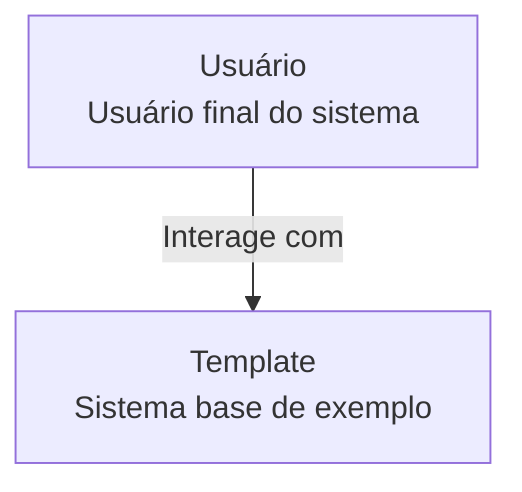
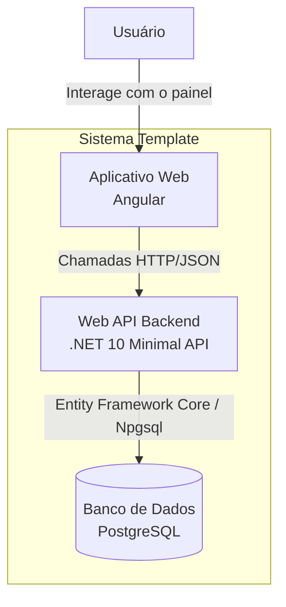
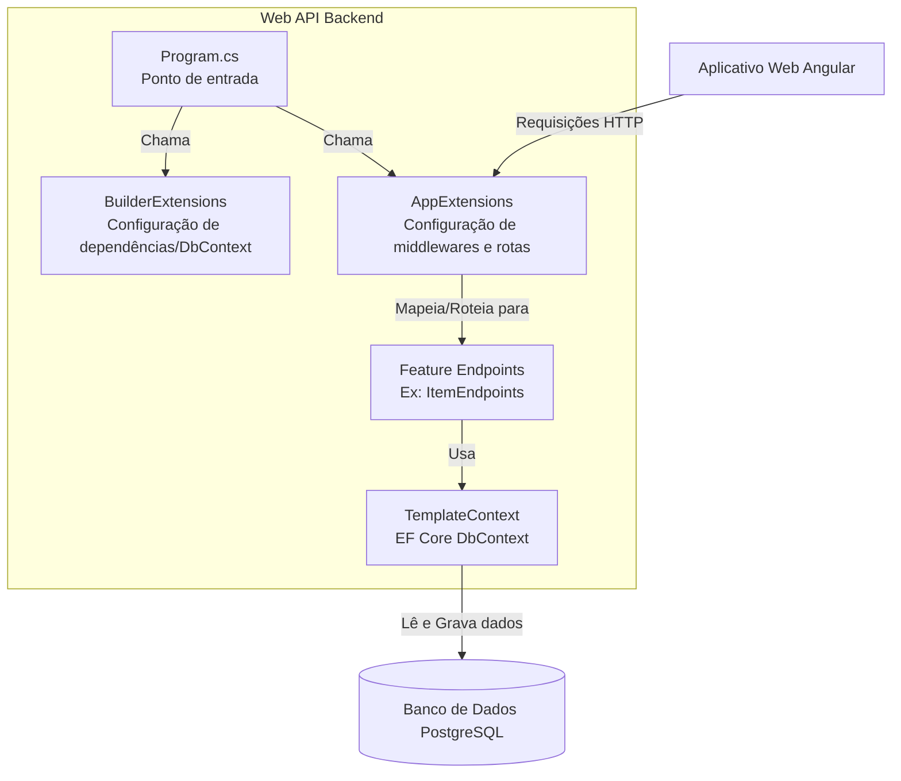

# Arquitetura do Template

Este documento descreve os níveis do projeto **Template**.

---

## 1. Nível 1: Contexto de Sistema

Abaixo está a representação de contexto mostrando como os usuários interagem com o sistema.

---

## 2. Nível 2: Contêineres

Detalhamento tecnológico dos contêineres que formam o ecossistema do **Template**.

---

## 3. Nível 3: Componentes

Detalhamento interno do contêiner da **API** com seus principais componentes.

